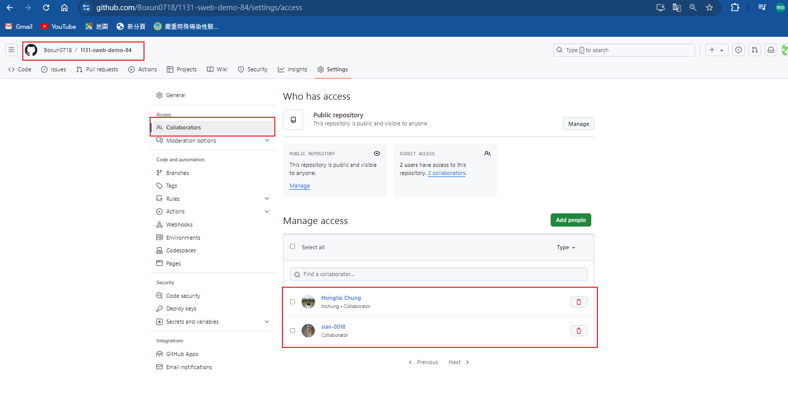
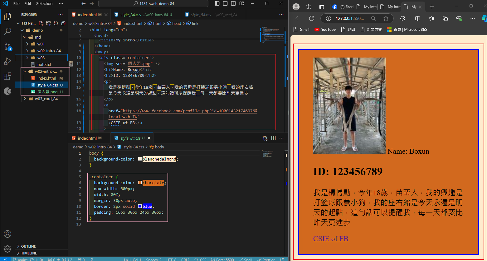

### W02-P1: Collaborate your Github repo to htchung@gms.tku.edu.tw and sian-0018 (TA)



```
c76e048 Boxun0718       Sun Sep 29 20:11:13 2024 +0800  W02-P1: Collaborate your Github repo to htchung@gms.tku.edu.tw and sian-0018 (TA)

```

### W02-P2: My Introduction using html with css selector (container)



```
79eaa39 Boxun0718       Sun Sep 29 20:17:50 2024 +0800  W02-P2: My Introduction using tag , <a>, <h1>, <h2>,<p> with csss seiector (container)
```

### w02-p3: git log of w2

```


```
