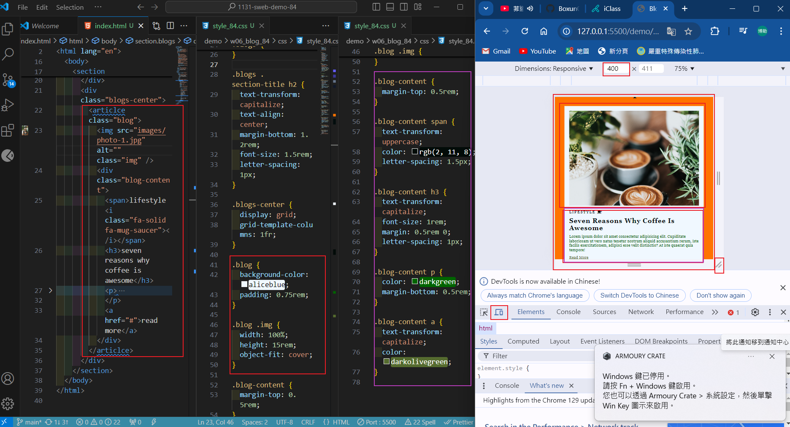
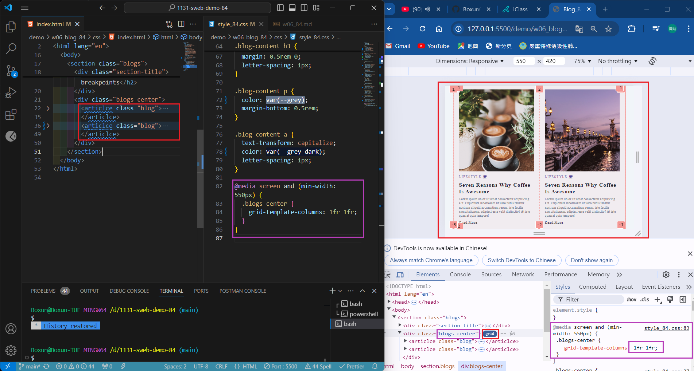
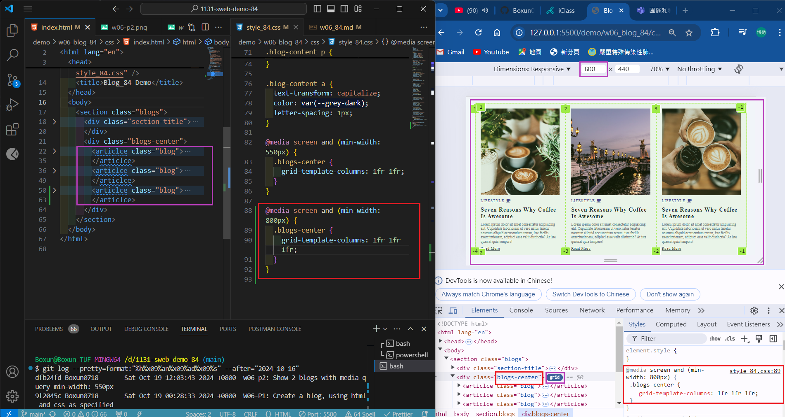
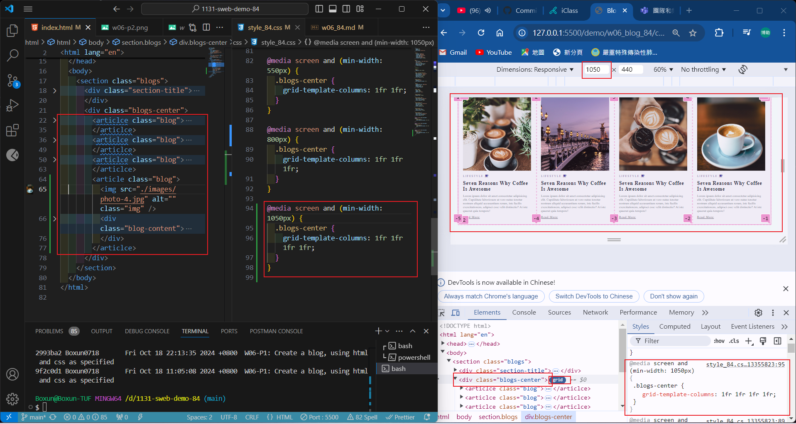
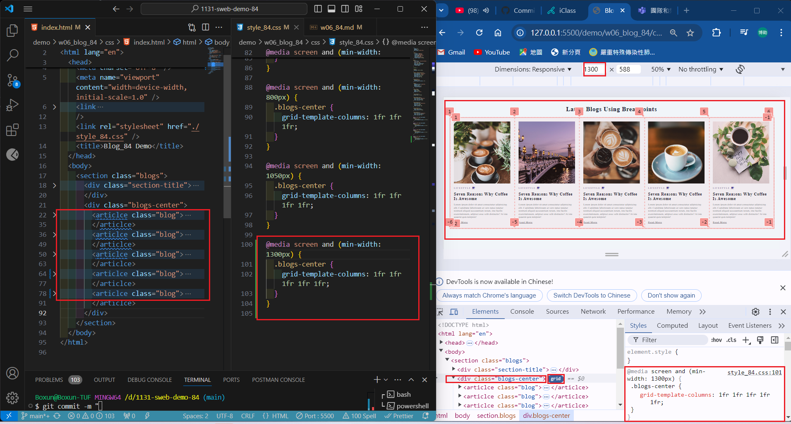
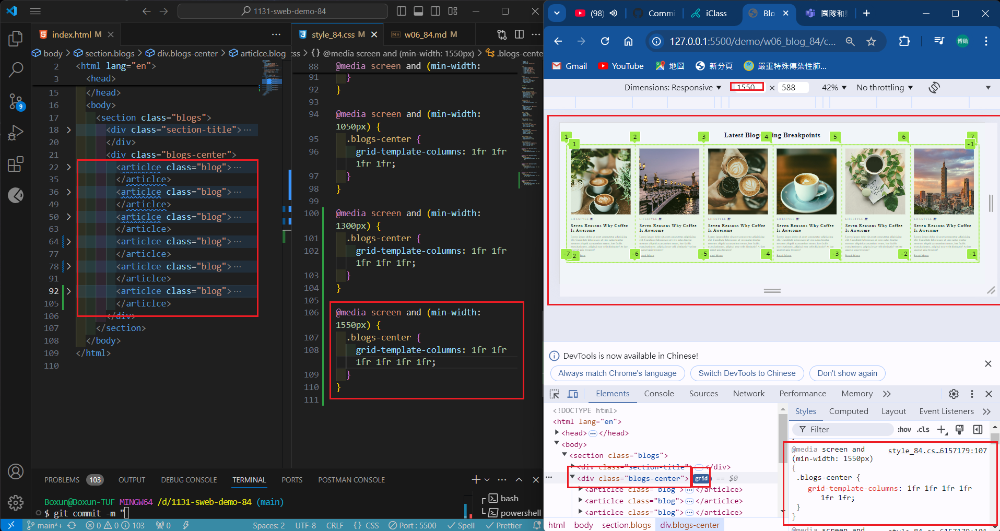

[My Github URL](https://github.com/Boxun0718/1131-sweb-demo-84)

### W06-P1: Create a blog, using html and css as specified



```
2993ba2 Boxun0718       Fri Oct 18 22:13:35 2024 +0800  W06-P1: Create a blog, using html and css as specified
```

### w06-p2: Show 2 blogs with media query min-width: 550px



```
dfb24fd Boxun0718 Sat Oct 19 12:03:43 2024 +0800  w06-p2: Show 2 blogs with media query min-width: 550px

```

### w06-p3: Show 3 blogs in a row with media query min-width: 800px



```


```

### w06-p4: Show 4~6 blogs in a row with corresponding media query min-width: px

### => 4 blogs in a row



### => 5 blogs in a row



### => 6 blogs in a row



```

```

### w06-p3: git logs of w06
