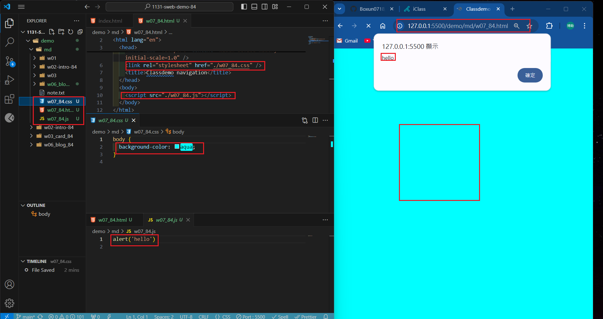
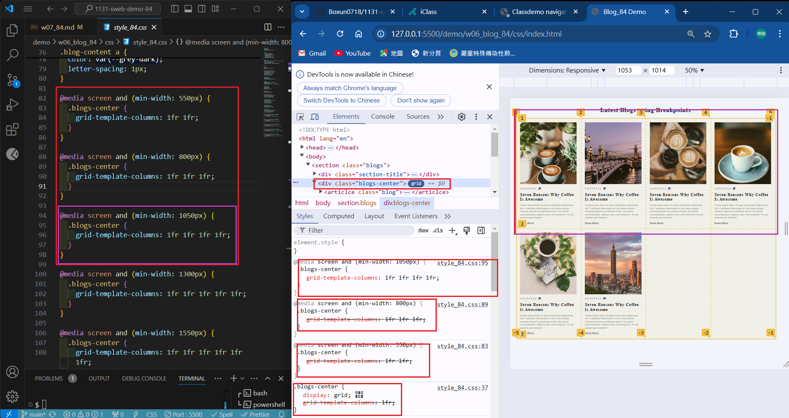
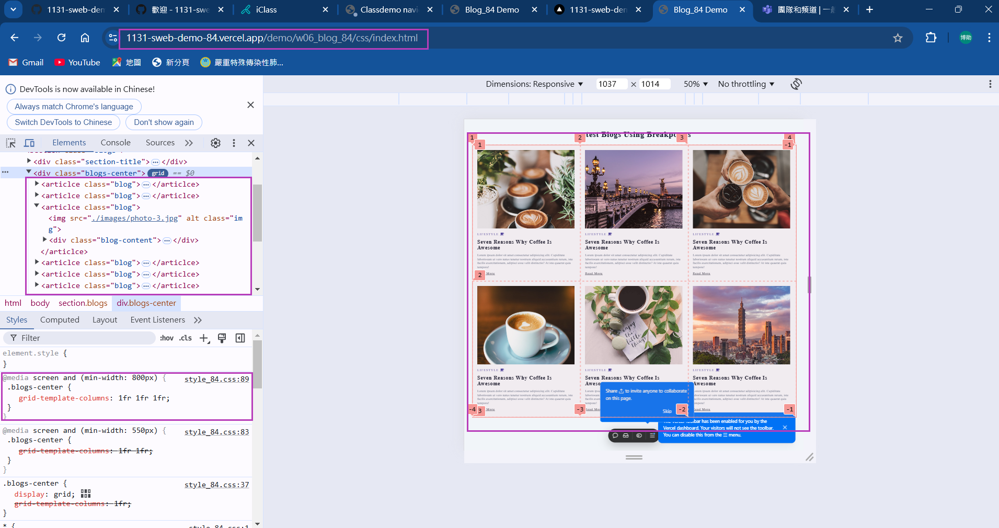
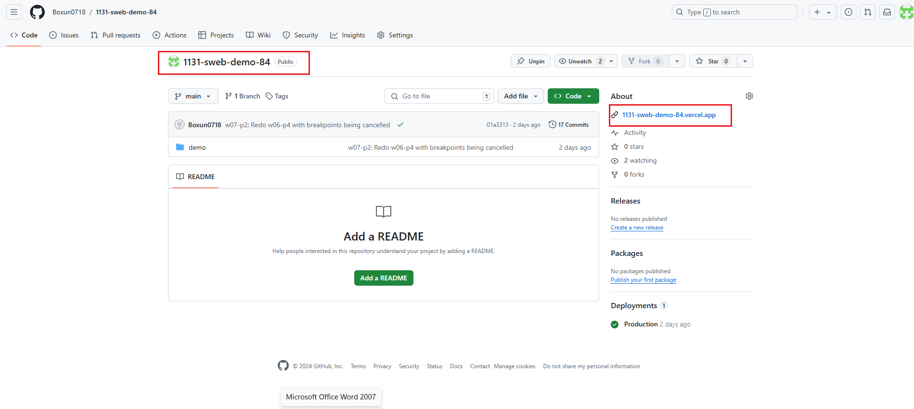
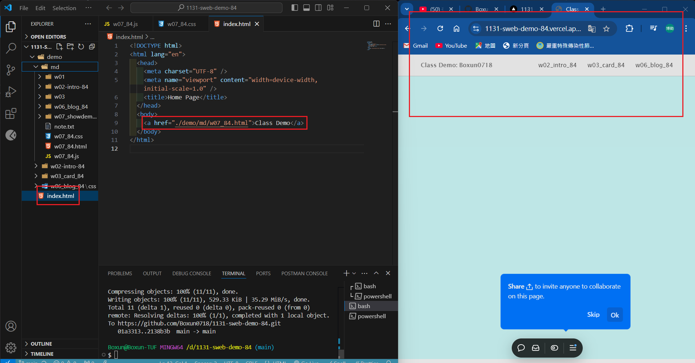

[My Github URL](https://github.com/Boxun0718/1131-sweb-demo-84)

### W07-P1: Test css and js for w07_84.html



```
a4e790d Boxun0718       Thu Oct 24 18:56:19 2024 +0800  W07-P1: Test css and js for w07_84.html
```

### w07-p2: Redo w06-p4 with breakpoints being cancelled



```
01a3313 Boxun0718       Thu Oct 24 19:20:21 2024 +0800  w07-p2: Redo w06-p4 with breakpoints being cancelled
```

### w07-p3: Connect your Github repo to Vercel and have a root home page to class demo navigation

### => In Vercel, show w06 blogs demo



```

```

### => Show your Github repo with Vercel URL





### w07-p4: Create navbar with links to class demo w02, w03, w06, and deploy it to Vercel

### w06-p3: git logs of w067


