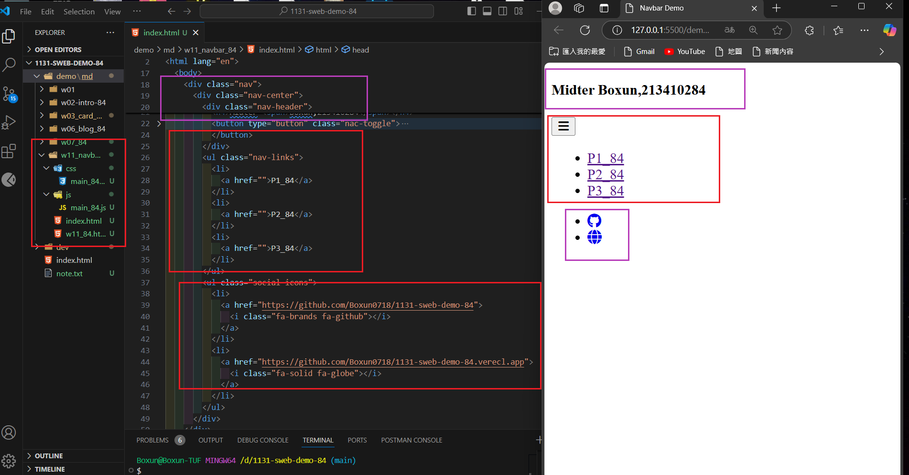
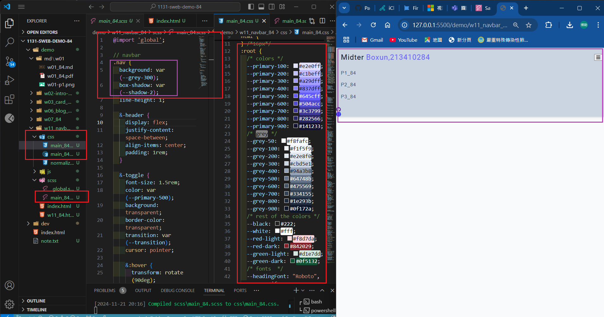
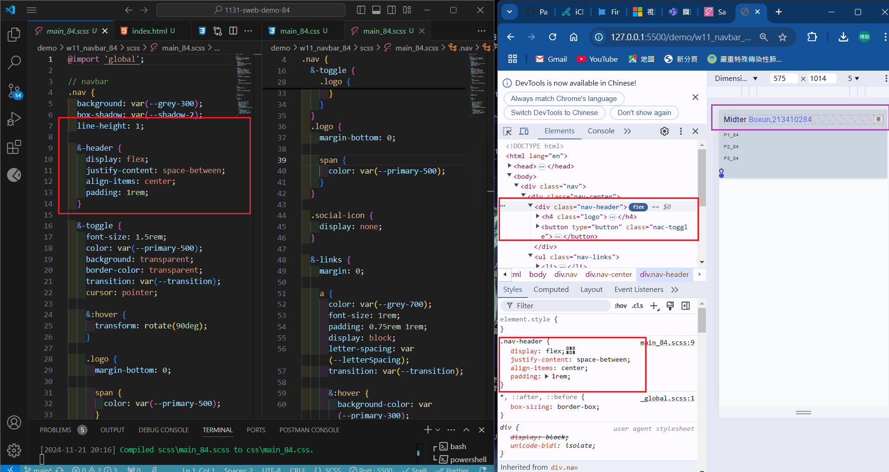
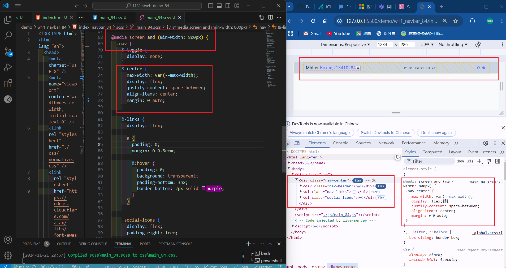
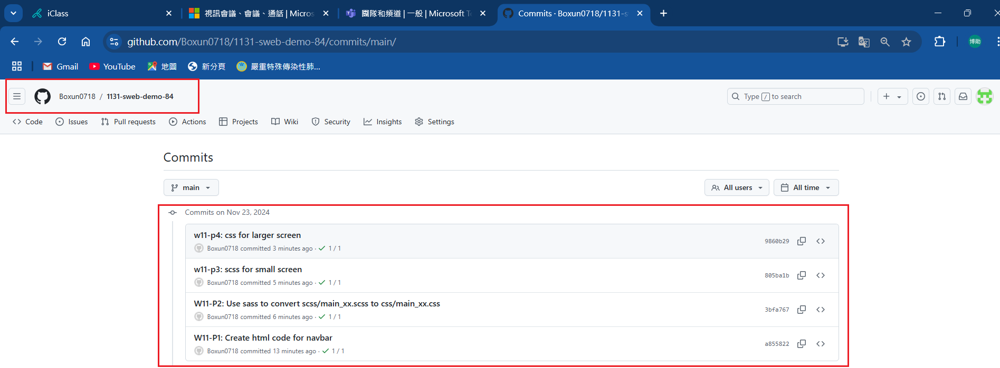

[My Github URL](https://github.com/Boxun0718/1131-sweb-demo-84)

[My Vercel URL](https://1131-sweb-demo-84.vercel.app/)

### W11-P1: Create html code for navbar



```
a855822 Boxun0718       Sat Nov 23 10:16:48 2024 +0800  W11-P1: Create html code for navbar
```

### W11-P2: Use sass to convert scss/main_xx.scss to css/main_xx.css



```
3bfa767 Boxun0718       Sat Nov 23 10:23:30 2024 +0800  W11-P2: Use sass to convert scss/main_xx.scss to css/main_xx.css
```

### w11-p3: scss for small screen



```

```

### w11-p4: css for larger screen



```

```

### w11-p5: git logs for W11


