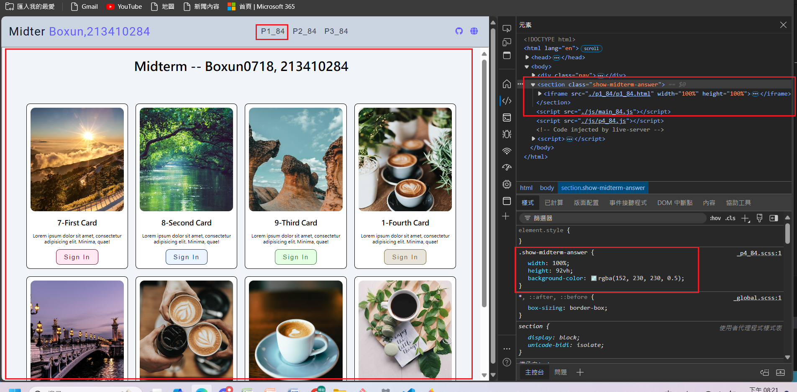
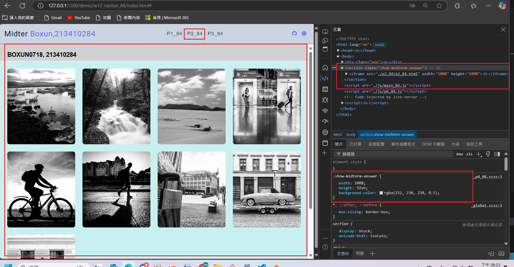
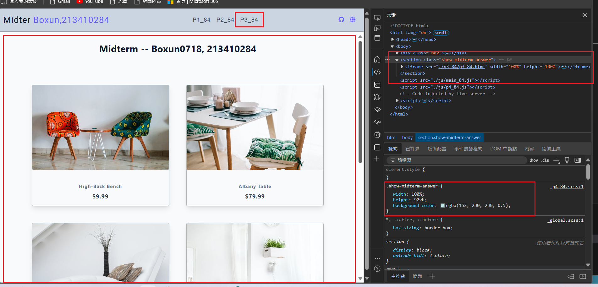

[My Github URL](https://github.com/Boxun0718/1131-sweb-demo-84)

[My Vercel URL](https://1131-sweb-demo-84.vercel.app/)

### W12-P1: show annser of p1_84, p2_84, p3_84 in midterm exam

### => show p1_84



### => show p2_84



### => show p3_84



```

```

### W12-P2:


```

```

### w12-p3:


```

```

### w12-p4:


```

```

### w12-p5: git logs for W12


```

```
