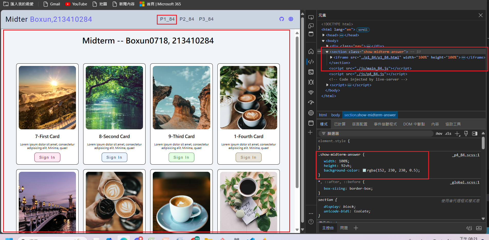
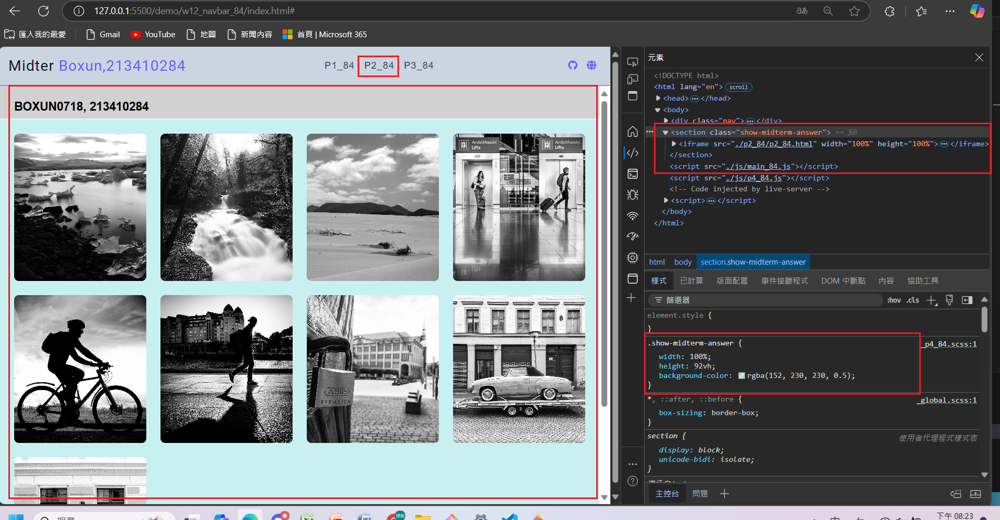
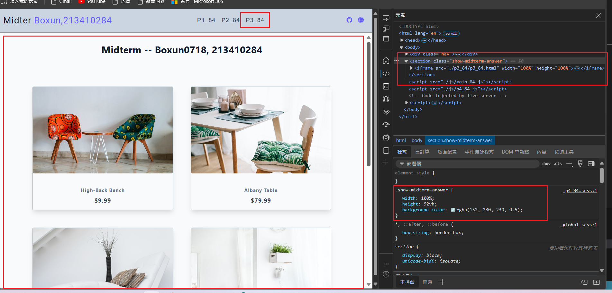
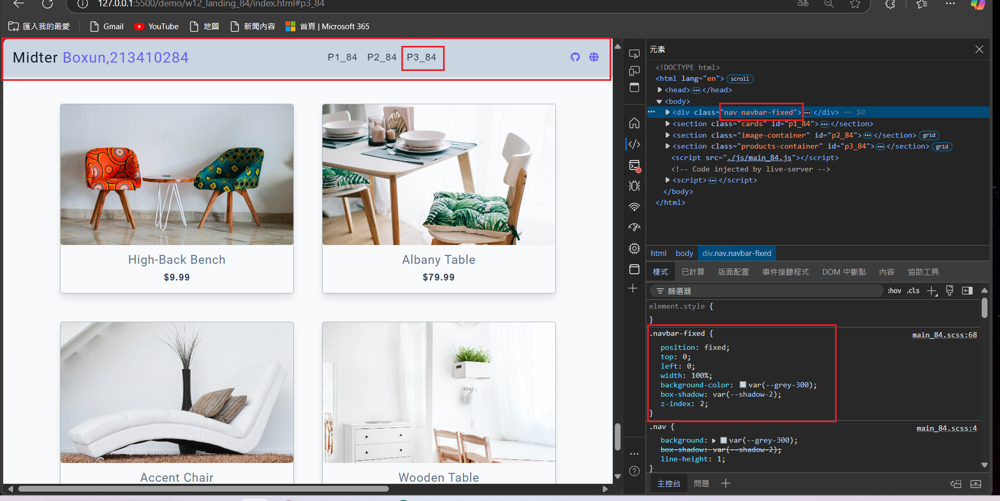
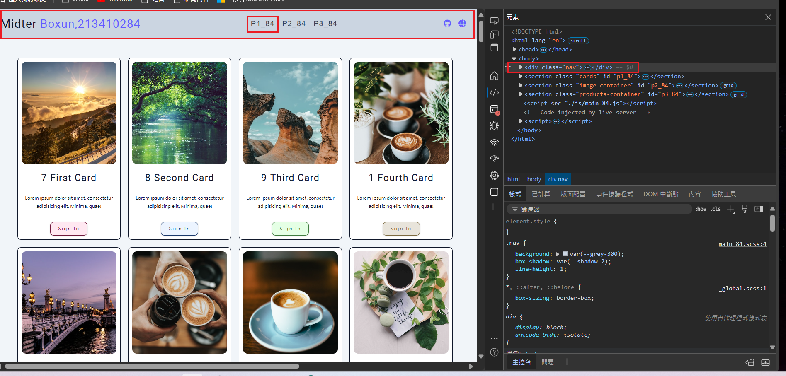
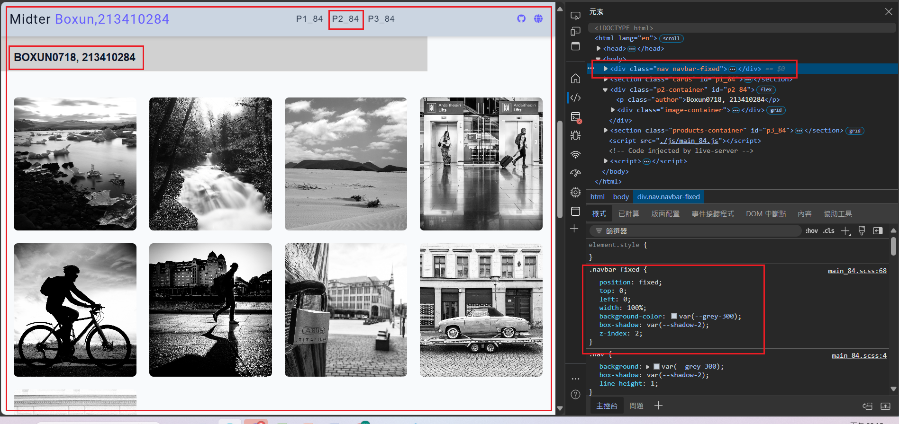
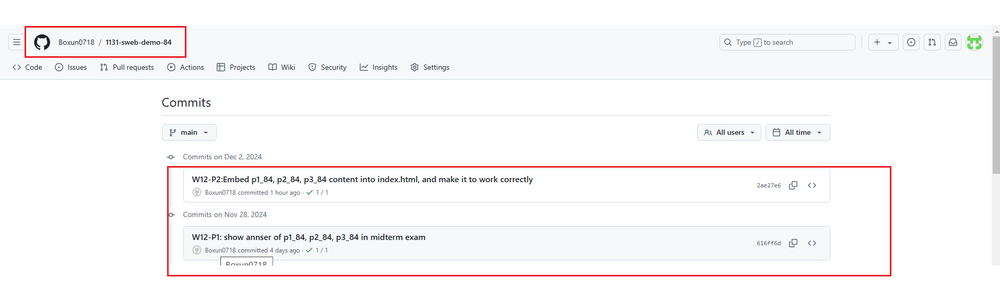

[My Github URL](https://github.com/Boxun0718/1131-sweb-demo-84)

[My Vercel URL](https://1131-sweb-demo-84.vercel.app/)

### W12-P1: show annser of p1_84, p2_84, p3_84 in midterm exam

### => show p1_84



### => show p2_84



### => show p3_84



```
616ff6d Boxun0718       Thu Nov 28 20:33:21 2024 +0800  W12-P1: show annser of p1_84, p2_84, p3_84 in midterm exam
```

### W12-P2:Embed p1_84, p2_84, p3_84 content into index.html, and make it to work correctly

### => select p3_84 nav link, navbar-fixed will be displayed



### => select p1_84 nav link, navbar-fixed will be displayed



### => select p2_84 nav link, navbar-fixed will be displayed



```
2ae27e6 Boxun0718       Mon Dec 2 20:21:12 2024 +0800   W12-P2:Embed p1_84, p2_84, p3_84 content into index.html, and make it to work correctly
```

### w12-p3: git logs for W12



```
6388d93 Boxun0718       Mon Dec 2 22:26:19 2024 +0800   w12-p3: git logs for W12
```
