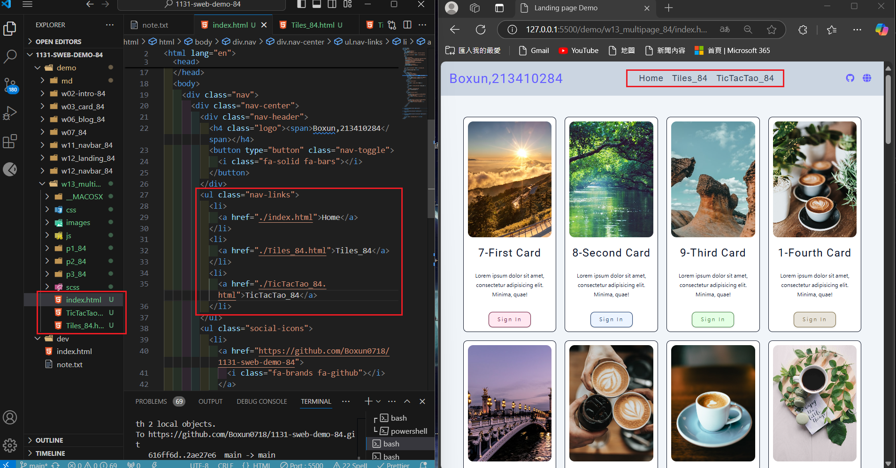
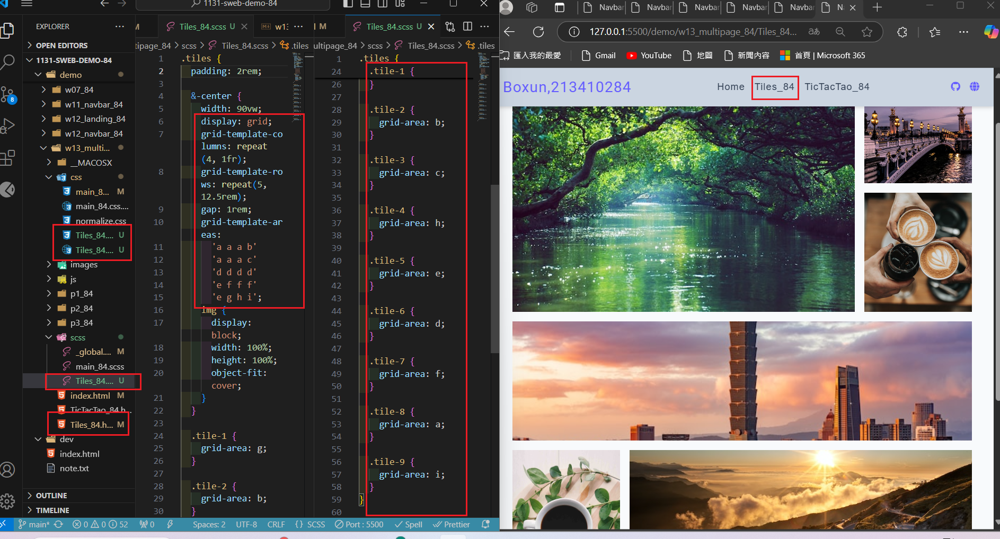
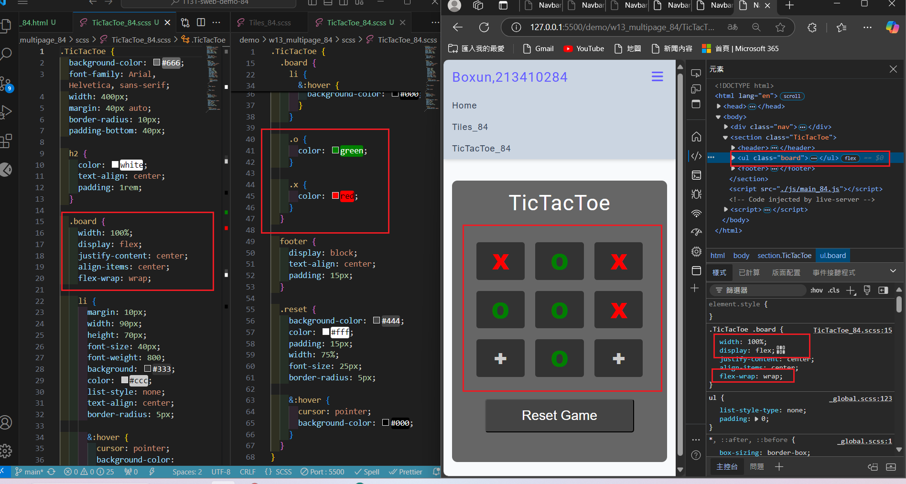
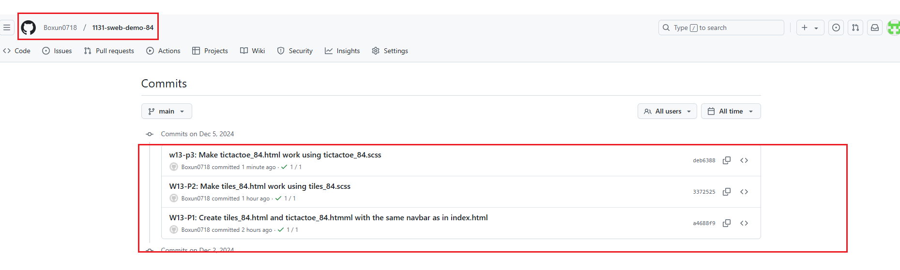

[My Github URL](https://github.com/Boxun0718/1131-sweb-demo-84)

[My Vercel URL](https://1131-sweb-demo-84.vercel.app/)

### W13-P1: Create tiles_84.html and tictactoe_84.htmml with the same navbar as in index.html



```
a4688f9 Boxun0718       Thu Dec 5 18:46:08 2024 +0800   W13-P1: Create tiles_84.html and tictactoe_84.htmml with the same navbar as in index.html
```

### W13-P2: Make tiles_84.html work using tiles_84.scss



```
3372525 Boxun0718       Thu Dec 5 19:48:48 2024 +0800   W13-P2: Make tiles_84.html work using tiles_84.scss
```

### w13-p3: Make tictactoe_84.html work using tictactoe_84.scss



```
deb6388 Boxun0718       Thu Dec 5 20:59:03 2024 +0800   w13-p3: Make tictactoe_84.html work using tictactoe_84.scss
```

### w13-p4: git logs for W13



```
7fe1bd0 Boxun0718       Thu Dec 5 21:02:28 2024 +0800   w13-p4: git logs for W13
```
