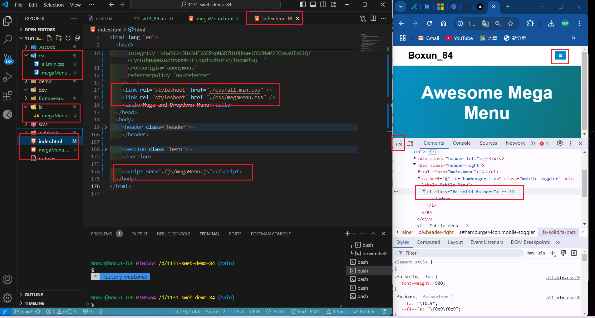
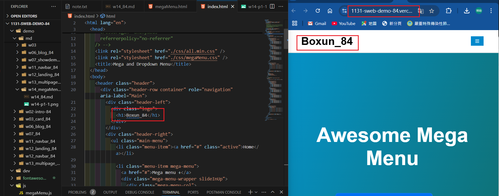
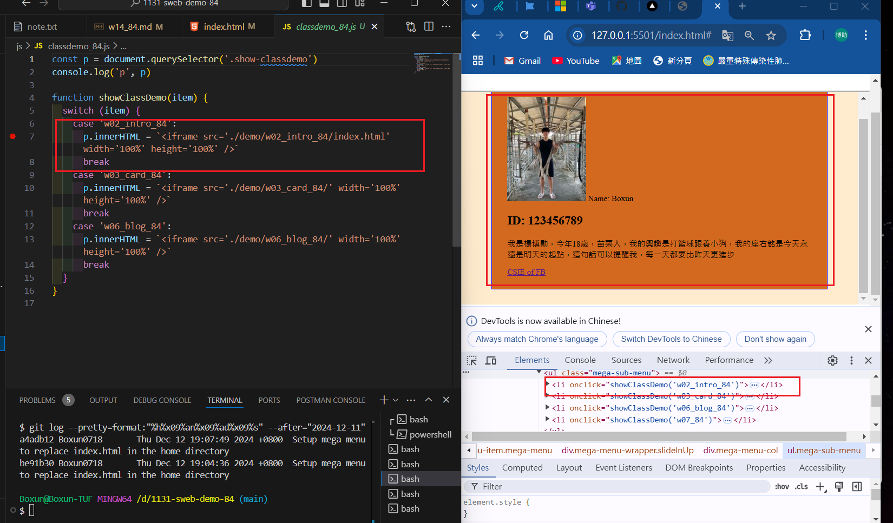
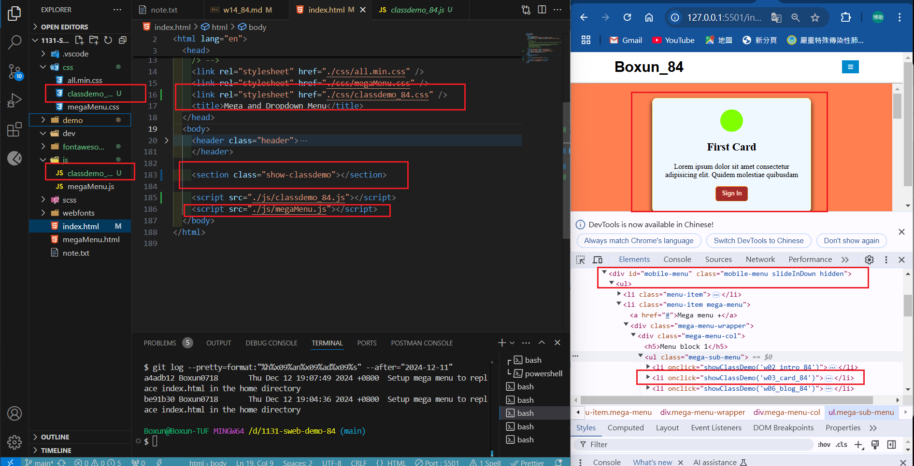
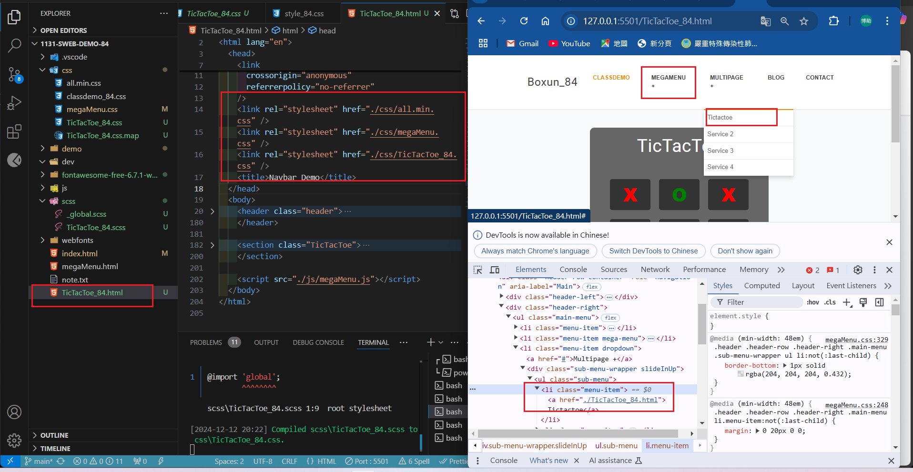
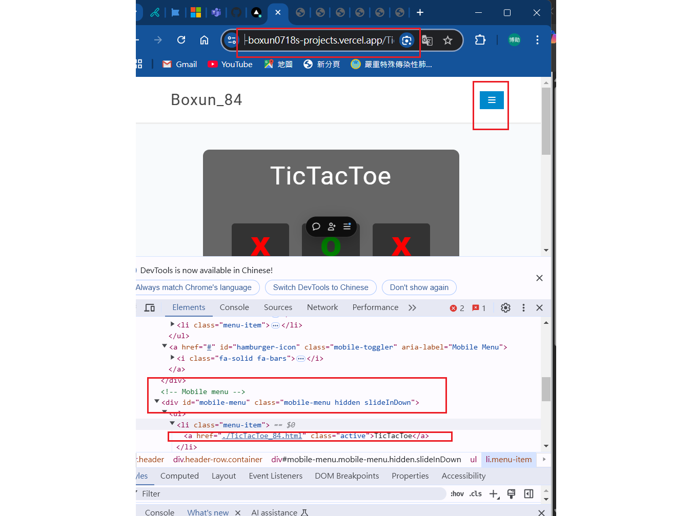
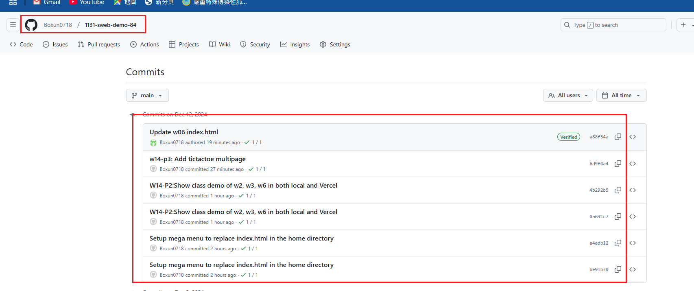

[My Github URL](https://github.com/Boxun0718/1131-sweb-demo-84)

[My Vercel URL](https://1131-sweb-demo-84.vercel.app/)

### W14-P1: Setup mega menu to replace index.html in the home directory

### => Show in local



### =>Show in Vercel



```
a4adb12 Boxun0718       Thu Dec 12 19:07:49 2024 +0800  Setup mega menu to replace index.html in the home directory
be91b30 Boxun0718       Thu Dec 12 19:04:36 2024 +0800  Setup mega menu to replace index.html in the home directory
```

### W14-P2:Show class demo of w2, w3, w6 in both local and Vercel

### => Show in local for w2



### => Show in local for w3



### => Show in Vercel for w6


```

```

### w14-p3: Add tictactoe multipage

### => Show in local



### => Show in Vercel



```

```

### w14-p4: git logs for W14



```

```
